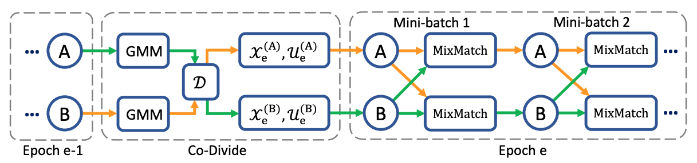

# DivideMix: Learning with Noisy Labels as Semi-supervised Learning
PyTorch Code for the following paper at ICLR2020:\
<b>Title</b>: <i>DivideMix: Learning with Noisy Labels as Semi-supervised Learning</i> <a href="https://openreview.net/pdf?id=HJgExaVtwr">[pdf]</a>\
<b>Authors</b>:Junnan Li, Richard Socher, Steven C.H. Hoi\
<b>Institute</b>: Salesforce Research

<b>Abstract</b>\
Deep neural networks are known to be annotation-hungry. Numerous efforts have been devoted to reduce the annotation cost when learning with deep networks. Two prominent directions include learning with noisy labels and semi-supervised learning by exploiting unlabeled data. In this work, we propose DivideMix, a novel framework for learning with noisy labels by leveraging semi-supervised learning techniques. In particular, DivideMix models the per-sample loss distribution with a mixture model to dynamically divide the training data into a labeled set with clean samples and an unlabeled set with noisy samples, and trains the model on both the labeled and unlabeled data in a semi-supervised manner. To avoid confirmation bias, we simultaneously train two diverged networks where each network uses the dataset division from the other network. During the semi-supervised training phase, we improve the MixMatch strategy by performing label co-refinement and label co-guessing on labeled and unlabeled samples, respectively. Experiments on multiple benchmark datasets demonstrate substantial improvements over state-of-the-art methods.

<b>Illustration</b>\

<b>Experiments</b>\
First, please create a folder named <i>checkpoint</i> to store the results.\
<code>mkdir checkpoint</code>\
Next, run \
<code>python Train_{dataset_name}.py --data_path <i>path-to-your-data</i></code>

<b>Cite DivideMix</b>\
If you find the code useful in your research, please consider citing our paper:

<pre>
@inproceedings{
    li2020dividemix,
    title={DivideMix: Learning with Noisy Labels as Semi-supervised Learning},
    author={Junnan Li and Richard Socher and Steven C.H. Hoi},
    booktitle={International Conference on Learning Representations},
    year={2020},
}</pre>

<b>License</b>\
This project is licensed under the terms of the MIT license.
